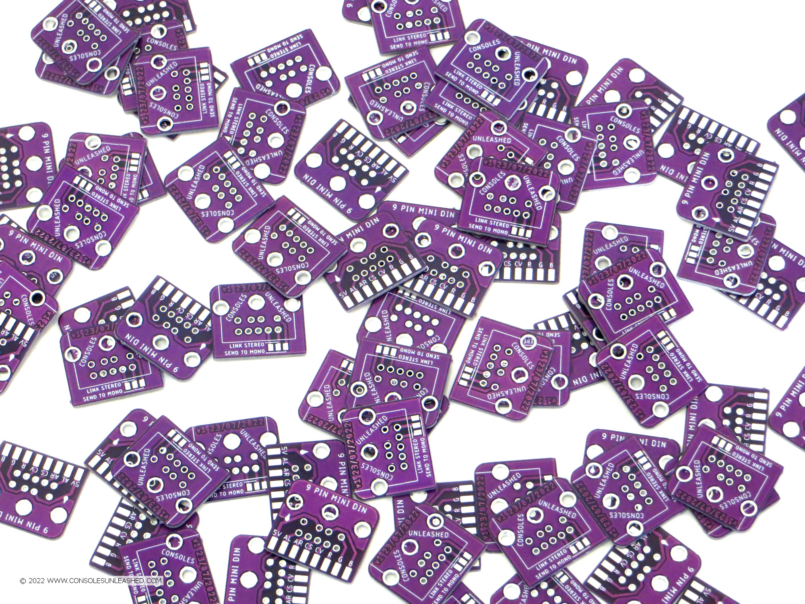

# 9-Pin Mini DIN Breakout PCB

A simple 9-Pin Mini DIN breakout PCB for AV modding consoles. Uses standard Sega Mega Drive 2 signal routing. Features a jumper to combine left and right audio channels, and a jumper to send the left audio channel, or both, to the mono audio pin. It's about as good as a 9-Pin Mini DIN breakout PCB could be.

## Manufacturing

- 1mm is perfect.

## Version History

v1 - 23/07/2022

## License

If you use this in any way, shape or form, you must include a link back to this repository and mention me by name on any sales pages and social media posts. Not only will this help me to keep designing mod kits and offering them to the community, but it is basic common courtesy as well. Don't be a douchebag. :)

Also this 'GNU GENERAL PUBLIC LICENSE Version 2, June 1991'.
